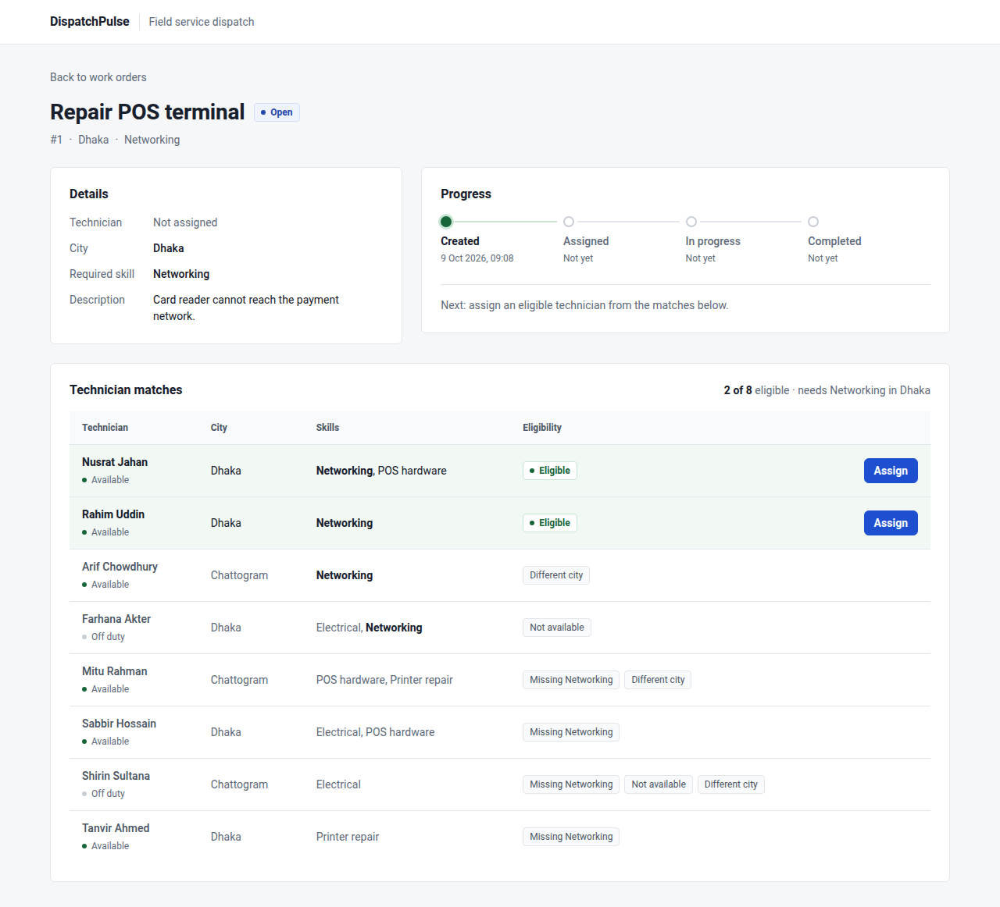
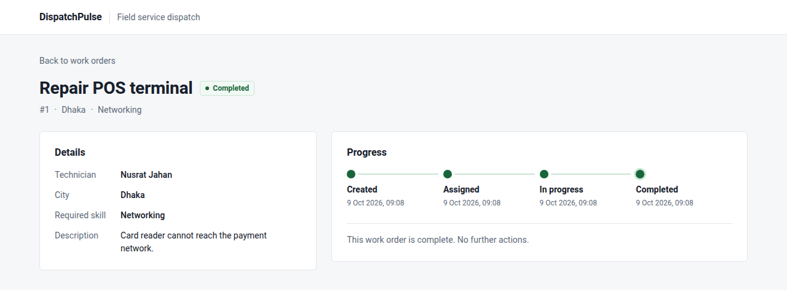
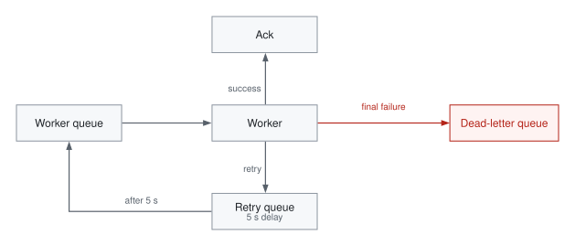
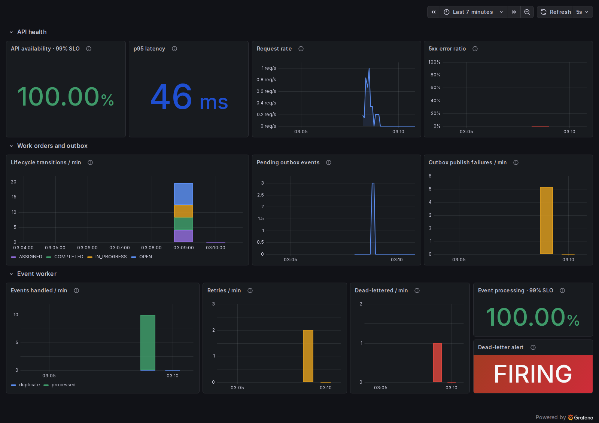
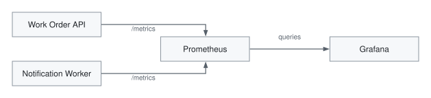

# DispatchPulse

A small field-service work-order platform demonstrating event-driven backend design,
concurrency-safe technician assignment and operational observability.

A dispatcher creates a work order, sees which technicians are eligible and why the others are
not, and assigns one. Every state change is committed together with an event that reaches a
separate notification service through RabbitMQ, even if the broker or the consumer is down at
the time.



*Technician matching keeps every candidate visible and explains why each one is or is not eligible.*

## What it demonstrates

| Area | Implementation |
|---|---|
| Backend | NestJS + TypeScript REST API with DTO validation and OpenAPI docs |
| Database | MySQL 8.4 + Prisma migrations, foreign keys, a CHECK constraint, verified index use |
| Frontend | React + TypeScript, Redux Toolkit / RTK Query, plain CSS |
| Messaging | RabbitMQ topic exchange, worker queue, retry queue, dead-letter queue |
| Delivery | Transactional outbox, publisher confirms, at-least-once delivery |
| Failure handling | Bounded retries with delay, dead-letter queue, idempotent consumer |
| Concurrency | Technician assignment that stays correct under simultaneous requests |
| Containers | Docker multi-stage images (non-root), Docker Compose |
| Observability | Prometheus metrics, one provisioned Grafana dashboard, one alert |
| SLOs | API availability and event-processing success, both 99% (demo targets) |

## Core workflow

Create → match technician → assign → start → complete.

```
OPEN ──assign──► ASSIGNED ──start──► IN_PROGRESS ──complete──► COMPLETED
```



*Lifecycle transitions are enforced by the API: OPEN → ASSIGNED → IN_PROGRESS → COMPLETED.*

The API enforces this lifecycle, not the UI: an illegal step (for example completing an OPEN
work order) is rejected with HTTP 409 and changes nothing. A technician can be assigned only
with the required skill, in the same city and while AVAILABLE; ineligible technicians stay
visible with the reasons, and assigning one is rejected (409 if they are busy, 422 if they can
never qualify).

## Architecture


Two services, deliberately: work orders and technicians stay together because assigning
changes both in one transaction. The notification worker owns its own database and receives
everything it needs in the event.

## Why the outbox exists

A MySQL commit and a RabbitMQ publish cannot be made atomic: publish after commit and a crash
loses the event; publish first and you may announce a change that rolls back. DispatchPulse
writes the event to an `outbox_events` table in the same transaction as the business change.
A relay inside the API publishes pending rows and marks them published only after RabbitMQ
confirms them. If RabbitMQ is down, the API request still succeeds and the event waits.

## Failure handling

Delivery is **at-least-once**, so the same event can arrive twice (for example when the relay
crashes after RabbitMQ confirmed a publish but before marking the row). The worker inserts one
notification per event, and a `UNIQUE(event_id)` constraint turns a second delivery into a
harmless "duplicate" instead of a second notification.



Each event gets at most 3 processing attempts, with a delay between them instead of an
immediate requeue loop. Messages that can never succeed (invalid JSON or envelope) skip the retries. Anything in
the dead-letter queue needs a person, and the one Prometheus alert says so.
Details: [docs/event-delivery-design.md](docs/event-delivery-design.md).

## Concurrency

Two dispatchers may assign the same AVAILABLE technician to different work orders at the same
moment. Inside the assignment transaction the API claims the technician with a conditional
update (`… SET status = 'BUSY' WHERE id = ? AND status = 'AVAILABLE'`), so only one request can
succeed; the other gets HTTP 409 and its transaction rolls back. An integration test sends
both requests at once and checks that exactly one wins. Writing that test exposed a real
MySQL deadlock (from foreign-key locks), fixed by claiming the technician first — see
[docs/work-order-lifecycle.md](docs/work-order-lifecycle.md).

## Observability



*A simulated consumer failure produces retries, one dead-letter event and a firing alert, while
the API stays available and a RabbitMQ outage's outbox backlog drains back to 0.*



One Grafana dashboard, provisioned from `infra/grafana`, shows:

- **API health:** availability SLO, p95 latency, request rate and 5xx ratio (HTTP metrics
  are labelled by route template, never by concrete URL)
- **Work orders:** lifecycle transitions, pending outbox events, publish failures
- **Event worker:** processed and duplicate events, retries, dead-lettered events
- **Two SLOs (99%, demo targets):**
  - API availability = non-5xx requests / all requests. A 4xx counts as served correctly.
  - Event processing = (processed + duplicate) / (those + dead-lettered). Retries are not
    final outcomes, and failures from the demo switch are excluded.
- **One alert,** `EventsDeadLettered`, fires when anything was dead-lettered in the last
  10 minutes. Latency is shown but is not a formal SLO.

## Failure demos

Both demos run with ordinary commands; `scripts/failure-demo.sh` runs them end to end and
prints what happens.

**RabbitMQ outage.** The API keeps accepting work and the outbox backlog grows; when the broker
returns, the backlog drains and the worker catches up.

```bash
docker compose stop rabbitmq
curl -X POST localhost:3000/work-orders -H 'Content-Type: application/json' \
  -d '{"title":"Replace router","city":"Dhaka","requiredSkill":"NETWORKING"}'   # 201
curl -s localhost:3000/metrics | grep '^outbox_pending_events'                    # 1
docker compose start rabbitmq    # relay publishes, worker reconnects and processes it
```

**Consumer failure.** With a demo switch, the worker fails every `workorder.completed` event:
attempt 1 → retry → attempt 2 → retry → attempt 3 → dead-letter queue → alert fires.

```bash
docker compose exec rabbitmq rabbitmqctl purge_queue notification-worker.dlq   # DLQ depth 0
SIMULATE_FAILURE_EVENT_TYPES=workorder.completed docker compose up -d notification-worker
scripts/failure-demo.sh          # ends with DLQ depth 1 and the alert FIRING
docker compose up -d notification-worker    # switch the simulation off again
```

## Running locally

Requires Docker with Compose v2, Node.js 24 (for the UI and the tests) and about 4 GB of free
memory. Ports used: 3000, 3001, 3030, 3306, 5173, 5672, 9090, 15672.

```bash
git clone https://github.com/SoniaTasmin/DispatchPulse.git
cd DispatchPulse
cp .env.example .env
```

Replace every `change-me-*` value in `.env` with your own local passwords (for example from
`openssl rand -hex 12`). Each password also appears inside the `*_URL` lines, so use
search-and-replace to keep them identical.

```bash
docker compose up -d --build --wait     # MySQL, RabbitMQ, API, worker, Prometheus, Grafana
cd apps/web && npm ci && npm run dev    # UI on http://localhost:5173
```

As a local demo convenience, the API container runs its migrations and seeds 4 skills and 8
demo technicians on start-up (the seed skips itself once technicians exist). This is not meant
as a production deployment pattern; see Trade-offs.

| What | URL |
|---|---|
| UI | http://localhost:5173 |
| API docs (Swagger) | http://localhost:3000/docs |
| RabbitMQ management | http://localhost:15672 (user and password from `.env`) |
| Prometheus, alerts | http://localhost:9090/alerts |
| Grafana dashboard | http://localhost:3030 (opens read-only without login) |

To return to a clean demo state (deletes all local data, then rebuilds and re-seeds):
`scripts/reset-demo.sh --yes`.

## Testing

The tests cover behaviour that matters rather than coverage numbers:

- legal and illegal lifecycle transitions, and technician eligibility with reasons (unit)
- create, full lifecycle, validation errors, and an illegal transition that must leave no
  state change and no outbox row (integration, real MySQL)
- two concurrent assignments of one technician: exactly one succeeds
- the relay keeps events pending while RabbitMQ is unreachable and publishes them, confirmed,
  afterwards
- duplicate delivery of one event produces exactly one notification
- a failing event is retried with a delay and then dead-lettered; an invalid event is
  dead-lettered without retries
- HTTP metrics are labelled by route template, never by concrete URL

```bash
docker compose up -d --wait mysql rabbitmq     # integration tests use their own test databases and vhost
cd apps/api && npm ci && npm test && npm run test:e2e
cd ../notification-worker && npm ci && npm test && npm run test:e2e
```

## Design documents

- [Work-order lifecycle](docs/work-order-lifecycle.md): rules, API contract, concurrency,
  index check
- [Event delivery](docs/event-delivery-design.md): outbox, topology, retries, DLQ,
  idempotency, failure cases

## Trade-offs

- **One outbox relay instance.** Several API replicas would publish the same rows (safe,
  because the consumer is idempotent, but wasteful).
- **Fixed 5-second retry delay,** no exponential backoff.
- **No authentication.** Start and complete are trusted to come from the assigned technician.
- **Dead-letter replay is manual,** through the RabbitMQ management UI.
- **No strict ordering.** The worker processes messages concurrently and retries reorder them;
  each notification is independent, so the application does not need ordering.
- **Migrations and the demo seed run when the containers start.** That keeps local set-up to one
  command, but is only safe with one replica of each service; a real deployment would run
  migrations as a separate step and would not seed demo data.

At larger scale: claim outbox rows with `SELECT … FOR UPDATE SKIP LOCKED` so several relays
can run, run migrations as a separate step before a rollout, alert on dead-letter queue depth
instead of a time window, add authentication and roles, and serve the UI as static files
behind a CDN.
